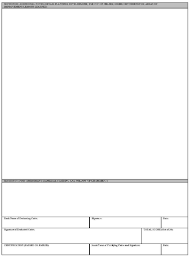

OBJECTIVE 8: Effective Followership, Leadership, and Teamwork Skills
======================

Demonstrate Effective Followership
--------------------------------------

| This objective can be accomplished through mission scenarios, group/team leadership problems, or assigned special projects. The Followership Evaluation Form found on the next page can be used for self-evaluation of followership skills; the form is most beneficial for use following a mission scenario or GLP.

**P1 Proficiency Level**

| Cadets should be able to demonstrate strong participation skills and be effective contributors.

**P2 Proficiency Level**

| Cadets should demonstrate a strong understanding of followership skills, anticipate the needs of the leader, and perform their roles based on the leader’s intent.
 
**P3 Proficiency Level** 

| Cadets should be able to apply all aspects of effective followership, evaluate the followership of team members using the AFROTC Followership Evaluation Form, and foster continued skills growth in subordinates.

Demonstrate Effective Team Leadership
--------------------------------------

| This objective can be accomplished through mission scenarios, group/team leadership problems, or assigned special projects. The Field Training Leadership Evaluation Form found on the next page is used at FT and can be used in FTP.
 
**P1 Proficiency Level**

| Cadets should be given an opportunity to apply the basics of team-leading throughout their first year in the program.
 
**P2 Proficiency Level**

| Cadets should be able to effectively lead small teams towards mission success.
 
**P3 Proficiency Level**

| Cadets should be able to apply all aspects of leadership skills, effectively lead teams, evaluate the performance of team leaders using the AFROTC Field Leadership Evaluation form, and foster continued skills growth in subordinates.

Demonstrate Effective Group Leadership as the POC-in-Charge
--------------------------------------

| This objective seeks to assess the group leadership skills of project officers in charge of leading, planning, and executing large scale events such as Leadership Laboratory, Physical Training, or special events.
 
**P2 Proficiency Level**

| ICL cadets should be able to demonstrate effective planning skills, time management, and leadership behaviors in order to obtain P2.
 
**P3 Proficiency Level**

| SCL cadets should be highly competent, proven project managers and leaders, and be able to effectively evaluate the performance of subordinate POC using the POC-In-Charge Evaluation Form.

Demonstrate the Principles of an Effective Debrief
--------------------------------------

| This objective seeks to instill the concept of mission debrief into all AFROTC training activities with a goal of building a culture of learning through shared experience. At a minimum, FTP cadets must be able to effectively lead a team debrief in order to obtain the P1 proficiency level.
 
**P2 Proficiency Level**

| Requires cadets to be able to debrief training events by facilitating group discussion, recalling points of failure and/or success, and identifying learning points.
 
**P3 Proficiency Level**

| The P3 level of proficiency requires cadets to fully appreciate the concept of effective debrief and how it ties to future mission success, identify root cause, pinpoint catalysts for success, and capture critical learning points from the activity. Qualified P3 cadets will also be able to effectively evaluate cadet-led debriefs while fostering continued growth in subordinates.
 
**Additional Information:**

| Cadets commonly mistake end-of-scenario feedback for debriefs. However, while feedback is primarily focused on the individual being evaluated, debrief is the team’s opportunity to openly discuss “how” the mission was executed, drill down to the root cause for any issues that occurred during the mission, and focus on areas of learning to help propel the team to future success. The debrief process is deeply rooted in the aviation community, however, the concepts can be applied cross-functionally. The instructor should strive to tie the value of candid and constructive debriefs as a foundational element of continued officer professional development and mission accomplishment.

**Debrief Focal Point (DFP) [WHY]:**

* Outwardly Focused
* Mission Impact of your Actions
* RESULT of what you did or did not do
 
**Contributing Factor (CF):**

* WHAT you did or did not do
* Assessed by asking why your actions impacted the mission
 
**Root Cause (RC)[WHAT]:**

* Ultimate factor or origin of failure that resulted in DFP
* Chosen from CF
 
**Instructional Fix (IF)[HOW]:**

* Course of action to prevent your RC during next mission
* HOW you changed
 
**Lessons Learned (LL):**

* WHEN - During…
* WHAT - I will not [RC]...
* HOW - By doing [IF]
* WHY - So that [DFP] does not happen
